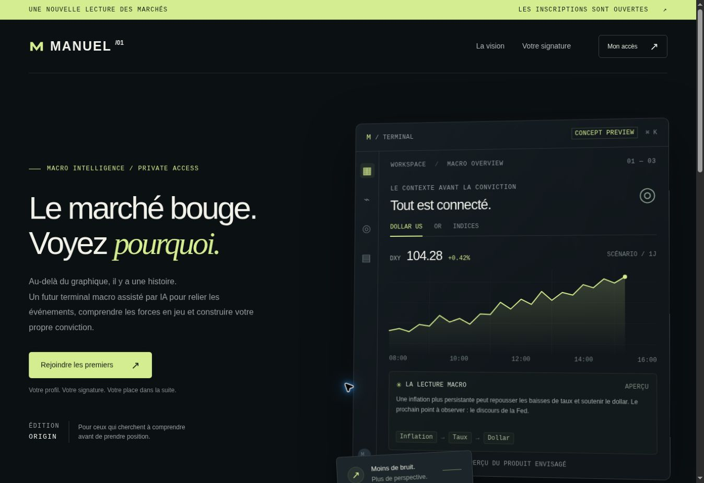

# MANUEL — Origin waitlist

Première version de la liste d’attente du futur terminal macro assisté par IA de Brydel et Manuel. **MANUEL est le nom de travail**, facile à remplacer. Le site est en français.



## Ce qui fonctionne

- Landing page responsive : noir graphite, accent citron pâle, détails de terminal et animations respectant `prefers-reduced-motion`.
- Aperçu interactif Dollar US / Or / Indices. Tous les cours et scénarios sont **fictifs et signalés comme tels**.
- Inscription en deux étapes : prénom/courriel, puis marché/horizon et consentement.
- Enregistrement serveur SQLite, contrainte unique sur le courriel et numéro d’inscription réel.
- Carte personnelle téléchargeable en SVG et portrait éditorial parmi 16 combinaisons marché/horizon. **Aucun modèle IA n’est appelé dans cette première version.**
- Profil privé récupéré via un cookie HttpOnly pendant 90 jours ; suppression possible depuis ce profil.
- Export CSV pour les fondateurs, en ligne de commande. Pas d’interface d’administration publique.
- Validation serveur, requêtes SQL préparées, vérification de l’origine, CSP, honeypot et limitation basique des tentatives.

## Démarrer en local

Node.js **24** requis. Aucune dépendance npm à installer.

```sh
npm start
# http://localhost:3000
```

Pour recharger le serveur pendant le développement : `npm run dev`.
Pour charger un fichier `.env` : `node --env-file=.env server.mjs`.

```sh
npm test
```

Les tests couvrent l’inscription, la persistance après redémarrage, les doublons, l’accès privé, le retrait, les validations, les requêtes cross-origin, l’expiration des sessions et les cookies HTTPS.

## Déployer sur Railway — clic par clic

1. Dans Railway, créer un projet et sélectionner **Deploy from GitHub repo**.
2. Choisir **brydel/ManuelProject**, branche `main`. Le `Dockerfile` et `railway.toml` sont déjà présents.
3. Ajouter un **Volume** au service, avec le point de montage **`/data`**. Il est indispensable : les inscriptions doivent survivre aux redéploiements.
4. Dans **Variables**, définir :

   | Variable | Valeur |
   | --- | --- |
   | `NODE_ENV` | `production` |
   | `DATABASE_PATH` | `/data/waitlist.sqlite` |
   | `RAILWAY_RUN_UID` | `0` |

   Les volumes Railway étant montés par root, `RAILWAY_RUN_UID=0` permet l’écriture sur le volume malgré le `USER node` du Dockerfile. Voir [la documentation officielle des volumes](https://docs.railway.com/volumes).

5. Dans **Settings → Networking**, générer le domaine public du service. `RAILWAY_PUBLIC_DOMAIN` fournit alors automatiquement l’origine autorisée. Si une cible de port est demandée, utiliser `3000`, ou la valeur de `PORT` si vous l’avez configurée.
6. Pour un domaine personnalisé, ajouter **`PUBLIC_URL=https://votre-domaine`**. Utiliser une seule origine canonique et rediriger les autres domaines vers elle. Ne pas ajouter de slash final ou de chemin.
7. Redéployer après la création du volume et du domaine. Sans domaine HTTPS configuré, le serveur de production refuse volontairement de démarrer.
8. Ouvrir le site, effectuer une inscription de test, puis redéployer et vérifier **Mon accès** dans le même navigateur.
9. Retirer l’inscription de test depuis la carte. Configurer les sauvegardes du volume dans Railway avant le lancement public.

Le healthcheck est **`/api/health`**. Le service utilise `PORT` et écoute sur `0.0.0.0`. Garder **une seule réplique** pour ce stockage SQLite. Une évolution multi-instance nécessitera un stockage partagé, par exemple PostgreSQL.

## Exporter la liste

Dans le conteneur/service possédant le volume, ou avec une copie sécurisée de la base :

```sh
node scripts/export.mjs > waitlist.csv
```

La commande utilise `DATABASE_PATH` et inclut prénom, courriel, préférences, date et version du consentement. Le fichier contient des données personnelles : ne pas le publier. Les fichiers `.env`, bases et CSV sont exclus de Git et de l’image Docker.

## Où personnaliser

| Élément | Fichier |
| --- | --- |
| Nom, textes et sections | `public/index.html` |
| Couleurs, typographie et responsive | `public/styles.css` |
| Portraits et scénarios | `public/app.js` |
| Export de la carte SVG | `card.mjs` |
| API, validation et stockage | `server.mjs` |
| Paramètres Railway | `railway.toml`, `Dockerfile` |

## Limites explicites de cette version

- Le terminal présenté est un concept ; ce dépôt contient la **liste d’attente**, pas l’application de trading.
- Le numéro de membre indique l’ordre d’enregistrement. Il ne représente ni un rang garanti d’invitation ni une promesse d’accès exclusif au terminal.
- Aucun courriel automatique n’est envoyé. Les invitations pourront être envoyées par les fondateurs à partir de l’export consenti, ou via une future intégration d’envoi.
- Les adresses ne sont pas encore vérifiées. Le honeypot et les limites en mémoire constituent une protection basique, pas une protection anti-abus complète pour une campagne massive.
- La récupération de carte sur un autre appareil n’est pas incluse. Un doublon de courriel ne révèle pas le profil et n’accorde pas de session. Le membre doit conserver son SVG ; un futur lien de connexion par courriel pourra permettre la récupération.
- Le retrait autonome nécessite la session d’origine active. Avant une campagne publique, compléter l’identité de l’exploitant et son adresse de contact dans la notice de confidentialité pour traiter aussi les demandes hors session.
- La configuration Docker est fournie ; un déploiement réel sur le compte Railway n’a pas été effectué depuis cette session.

## Architecture

HTML/CSS/JavaScript natifs côté interface ; serveur HTTP et SQLite intégrés à Node 24. Cette version est volontairement légère : pas de compilation, pas de dépendance externe, pas de clé d’API. Les données et secrets ne sont jamais placés dans le frontend.

## Vérifications effectuées

- Quatre tests serveur passent, dont l’export SVG authentifié.
- Parcours d’inscription effectué dans Chrome avec des données fictives ; portrait et session retrouvés après rechargement.
- Rendu contrôlé à 1363 px et dans des cadres de 390 et 320 px ; aucun débordement horizontal mesuré après correction.
- Le navigateur de vérification a expiré lors de la récupération du fichier téléchargé ; le fichier SVG et ses en-têtes sont validés au niveau HTTP. Refaire le clic de téléchargement après mise en ligne.
- Image Docker non construite dans cette session et déploiement Railway non effectué.
